# Process Decomposition

The second top-down entry into the `ai-refinement` pipeline's hierarchy,
alongside — never instead of — `value-decomposition`: where that skill
tailors to adaptive, incremental, stakeholder-value-sliced work (PMBOK 7's
tailoring principle), this skill tailors to predictive, plan-driven,
sequence-driven work, grounded in PMI/PMBOK practice rather than the Value
Delivery deck. Given a parent-level work item (or a described operational
rollout) whose work is inherently repetitive, sequential, and
procedure-driven, it proposes an ordered, dependency-linked set of children
grounded in an existing (or newly elicited) runbook, for user review, before
handing each accepted child onward exactly as `value-decomposition` does. It
replaces the manual practice of hand-transcribing a runbook into a flat,
unordered pile of Jira tickets, and retires `value-decomposition`'s own
step-5 "technical/project-driven framing" exception from having to carry
this entire category of work as a one-off per-child carve-out.

## Flow Diagram

```mermaid
flowchart LR
    Start(["Trigger: Stage 01 parent-level item,<br/>process-shaped decomposition requested"]):::start --> P1["Step 1 — Confirm & locate<br/>the grounding runbook"]:::process
    P1 --> RB{"Runbook exists?"}:::decision
    RB -->|"No"| HR["Name the gap — point to<br/>documentarian, then resume"]:::halt
    HR -.->|"runbook supplied"| P1
    RB -->|"Yes"| P2["Step 2 — Identify axes<br/>Stage (phase) × area (cohort)"]:::process
    P2 --> P3["Step 3 — Propose ordered,<br/>dependency-linked set"]:::process
    P3 --> C1{"Step 4 — 100% Rule check:<br/>every step ↔ every child?"}:::decision
    C1 -->|"gap found,<br/>either direction"| HG["Flag uncovered step or<br/>ungrounded child — revise"]:::halt
    HG -.->|"revise proposal"| P3
    C1 -->|"complete"| P5["Step 5 — Rolling-wave bound<br/>Imminent cohort in full;<br/>later cohorts as milestones"]:::process
    P5 --> P6["Step 6 — Technical framing +<br/>rollback/contingency child<br/>per stage sequence"]:::process
    P6 --> P7["Step 7 — Verification-based<br/>acceptance criteria per child"]:::process
    P7 --> P8["Step 8 — Present full<br/>ordered/cohort/milestone set"]:::process
    P8 --> D{"User verdict?"}:::decision
    D -->|"not ready / stop"| H["Stop cleanly —<br/>no children created"]:::halt
    D -->|"accept all / edit /<br/>reject some"| P9["Step 9 — Hand off<br/>accepted children"]:::process
    P9 --> DEST{"Set large enough for<br/>a bulk pass?"}:::decision
    DEST -->|"few children /<br/>need real refinement"| Output(["Output: accepted children,<br/>each its own Band 2 run<br/>(Stage 02 onward)"]):::output
    DEST -->|"many children,<br/>user accepts the offer"| OutputB(["Output: accepted set handed to<br/>bulk-child-creation (Band ③)<br/>— acknowledgment taken there"]):::output

    classDef start fill:#1e293b,stroke:#94a3b8,color:#f1f5f9
    classDef process fill:#1e3a8a,stroke:#60a5fa,color:#dbeafe
    classDef decision fill:#78350f,stroke:#fbbf24,color:#fef3c7
    classDef output fill:#14532d,stroke:#4ade80,color:#dcfce7
    classDef halt fill:#7f1d1d,stroke:#f87171,color:#fee2e2
```

## Triggering intent

- **Fires on:** Stage 01 of `ai-refinement`, when the user has selected a
  parent-level type (`portfolio_epic`, `solution_epic`, `feature`) and
  frames its work as a repetitive, sequential, operational rollout rather
  than a value-sliceable initiative — "we need to patch these 40 servers
  over the next month," "help me break down this OS upgrade," "decompose
  this migration runbook into tasks," "same steps across each environment —
  dev, staging, then prod," or any parent whose grounding content is, or
  points at, an existing runbook, playbook, or step-by-step procedure
  document.
- **Does not fire on (near-misses):**
  - **Ordinary value-shaped decomposition.** A portfolio/solution epic or
    feature whose children are genuinely distinguished by stakeholder
    outcome, not execution order — stays `value-decomposition`, unaffected.
  - **A single technical/infra child amid an otherwise value-shaped set.**
    `value-decomposition`'s existing step-5 exception — electing a
    technical/project-driven framing for one child within a value-shaped
    decomposition — is unaffected and stays there. This skill fires when
    the *whole parent* is process-shaped, not when one sibling among
    value-shaped children happens to be technical. This is the
    load-bearing boundary line between the two skills; a decomposition
    pass with a mixed set (some value-sliced children, one infra child) is
    `value-decomposition`'s job, not this skill's.
  - **An already-decided flat task list with no sequencing or runbook
    shape.** A spreadsheet or enumerated list where the user has already
    decided the items and their content — goes straight to
    `bulk-child-creation`, same as today; this skill decides *what the
    sequence and structure* should be, it doesn't take a settled,
    unordered set and create it.
  - **Ongoing, unscoped operational work with no bounded pass to plan.**
    PMI's operations-vs-projects distinction: this skill scopes and plans
    one bounded cycle of a recurring operational process (e.g., "the Q3
    patch cycle"), not an open-ended adoption of an ongoing operation into
    the backlog.
  - **`story`/`task`/`spike`/`bug` as the parent of a pass.** Same floor as
    `value-decomposition` — decomposition below Feature isn't this skill's
    model either.

## Method

1. **Confirm and locate the grounding runbook.** Restate the parent item's
   content, then ask for or locate the procedure it's grounded in: an
   attached document, a linked page, or a described sequence of steps. If
   no runbook exists, this skill does not author one — it names the gap and
   points at the `documentarian` flowspace to produce the procedure first,
   then resumes from here. Missing content is asked for, never invented.
2. **Identify the decomposition axes** (Practice Standard for Work
   Breakdown Structures — decomposition by phase and by area/responsible
   unit): the *stage axis* — the runbook's own phases, typically something
   like pre-check → execute → verify → rollback-contingency — and, where
   the same stage sequence repeats across a population, the *area axis* —
   server group, region, environment, or responsible team (a wave/cohort
   structure).
3. **Propose an ordered, dependency-linked set.** Horizontal, sequence-driven
   structure is *correct and expected* here — the direct opposite of
   `value-decomposition`'s vertical-only rule. Each child names its
   relationship to its predecessor(s) using PMI's Sequence Activities
   vocabulary: Finish-to-Start as the default (most runbook steps can't
   start until the prior one finishes), Start-to-Start or Finish-to-Finish
   where steps genuinely overlap, and a dependency class — mandatory (hard
   logic: can't verify before executing), discretionary (best-practice
   ordering, not a hard constraint), or external (e.g., a vendor-owned
   maintenance window). This relationship/class pair is named per link, not
   carried as a schema field — see "Dependency and milestone
   representation," below.
4. **Apply the 100% Rule as a completeness check** against the proposal
   step 3 just built. Every in-scope runbook step maps to a proposed child,
   and every proposed child cites the runbook step it came from — flag a
   runbook step with no child, and flag a child with no runbook grounding,
   symmetrically, and revise the proposal before continuing. This is this
   skill's direct analog to `value-decomposition`'s vertical-slice check: a
   structural correctness gate before the set goes to the user.
5. **Rolling-wave-bound the set.** Apply progressive elaboration: decompose
   the imminent cohort/wave in full step-by-step detail; represent later
   cohorts only as a milestone (a named, zero-duration marker for that
   wave's planned completion), to be elaborated in its own follow-up pass
   closer to its start. This is this skill's PMI-native analog to
   `value-decomposition`'s MVP-bounding step — it bounds the proposal
   without needing a value or MVP framing at all.

   *Worked example.* A four-stage runbook (pre-check → execute → verify →
   rollback-contingency) applied across three waves (dev, staging, prod)
   decomposes wave 1 (dev, imminent) into all four stages as full children;
   waves 2 and 3 (staging, prod) each collapse into a single milestone
   child ("Staging wave — planned completion") rather than eight more
   fully-drafted children. The milestones still carry their Finish-to-Start
   dependency on wave 1's completion; they just carry no stage-level detail
   yet.
6. **Technical/procedural framing by default, with a named rollback/
   contingency child per stage sequence.** Every child is worded
   technically/procedurally — reusing the wording `value-decomposition`
   already sanctions as an elected exception, but as this skill's default
   rather than a per-item election. Every stage sequence carries an
   explicit rollback/contingency child tied to its execute step, grounded
   in PMI risk-response planning rather than left implicit.
7. **Verification-based acceptance criteria per child.** An objectively
   checkable pass/fail condition tied to the runbook step (e.g., "patch
   level confirmed via `<command>`; service confirmed running"), not a
   stakeholder-value narrative. Acceptance criteria stays a hard schema
   gate for every child's own Band 2 run, identical to every other item in
   the pipeline — decomposition, of either kind, never relaxes it.
8. **Present the full ordered/cohort/milestone set together for user
   review.** Same verdict vocabulary as `value-decomposition`: accept all,
   edit some, reject some, or stop entirely ("not ready to plan this cycle
   yet") — a stop creates nothing. No child proceeds without an explicit
   verdict.
9. **Hand off accepted children onward.** Two destinations, the user's
   choice, same as `value-decomposition`: each accepted child's own Band 2
   run (Stage 02 onward), pre-seeded with the runbook's grounding content
   and its dependency/sequence position; or, offered (never selected) when
   the accepted set is large enough that N sequential runs would be
   disproportionate — typical for repetitive work, since repetition
   usually means volume — a single bulk creation pass via
   `bulk-child-creation`, with wave-completion milestones surfaced
   alongside the batch. This skill never sets a parent link and never
   commits anything to Jira itself, identical to `value-decomposition`.

### Dependency and milestone representation

Resolved at build time (the brief's open item — see the skill-foundry
decision log for the reasoning), not left implicit:

- **Dependencies use native Jira issue-links**, not a schema extension.
  This skill names the relationship type (Finish-to-Start default,
  Start-to-Start/Finish-to-Finish where steps overlap) and the dependency
  class (mandatory/discretionary/external) per link in conversation and at
  handoff; Stage 06's `parent_mapping_confirmation` (or a
  dependency-equivalent step alongside it) is still the only mechanism that
  creates the actual link, exactly as it is the only mechanism that sets a
  parent link.
- **Milestones are a presentation-layer concept only**, with no Jira
  footprint of their own. A wave-completion milestone is surfaced in this
  skill's proposal and carried into the handoff as context, not created as
  a Jira artifact. If a later wave needs a trackable placeholder in Jira
  before its own decomposition pass runs, that is a separate, explicit
  operator decision — this skill does not invent one.

### Known failure modes to guard against

- **Inventing runbook steps instead of citing or asking.** The 100% Rule's
  other direction — content with no source is exactly as damaging here as
  an uncovered step.
- **Collapsing the area × phase structure into a flat, unordered list** —
  losing the "same steps repeat per cohort" shape the whole method exists
  to preserve.
- **Forcing the persona-value-statement format onto procedural children**,
  or, conversely, silently reusing this skill's technical framing for a
  child that's actually value-shaped (that's `value-decomposition`'s
  territory).
- **Treating verification acceptance criteria, or the rollback/contingency
  child, as optional** because the work "isn't really value work."
- **Decomposing every future wave to full depth up front**, defeating
  rolling-wave planning's whole purpose and producing the same
  disproportionate-ceremony problem `bulk-child-creation` exists to solve
  on the volume side.

## Inputs and grounding

Reads: the parent item's confirmed Stage 02–04 field values (or its
already-committed Jira content, via read-only lookup, when decomposing a
live item); the referenced runbook/procedure document (this skill's primary
grounding source, replacing the "Value Delivery" deck for this path —
read-only, never authored here); the work-item schema registry
(`reference/work-item-schemas.md`) for the hierarchy's parent→child map and
each child type's field set. Grounding rules: parent content and runbook
content are restated from their source, never invented — a missing
procedure is asked for or routed to `documentarian`, never fabricated;
every proposed child cites the runbook step it came from; "not found" over
fabrication when a live parent lookup fails.

## Data boundary

- Max data-class: internal, matching the rest of the `ai-refinement`
  pipeline. Runbooks for infrastructure/OS-level work are a higher-risk
  carrier (credentials, internal hostnames, network topology may appear
  inline) — the same data-class screen the rest of the pipeline applies
  runs before runbook content is quoted or carried into any drafted child.
- Sanctioned engines: Rovo and Copilot, per the employer matrix — no
  engine-specific constraint identified.

## What this skill is not

- **Not `value-decomposition`.** That skill owns genuinely value-shaped
  decomposition, including the rare single technical/infra child inside an
  otherwise value-shaped set (its own step-5 exception, unchanged and still
  the right path for that specific case). This skill owns the case where
  the *whole parent* is process-shaped — the load-bearing line between the
  two.
- **Not the runbook author.** A parent with no grounding procedure is
  routed to the `documentarian` flowspace to produce one; this skill never
  invents runbook steps to fill the gap.
- **Not the bulk creator.** `bulk-child-creation` takes an already-decided,
  unordered set and builds it. This skill decides *what the sequence and
  structure* should be; a flat list with no sequencing or runbook shape
  goes straight to `bulk-child-creation` and never passes through here.
- **Not an operations-adoption tool.** It scopes and plans one bounded pass
  of a recurring operational process (PMI's operations-vs-projects
  distinction); it does not adopt an ongoing operation into the backlog,
  and it does not replace any separate change-management/ITSM system of
  record — where one exists, this skill's output feeds it rather than
  substituting for it.
- **Not the parent-linker or a Jira writer.** Stage 06's
  `parent_mapping_confirmation` remains the only mechanism that creates a
  dependency link or a parent link; this skill names the relationship type
  and dependency class per link, it never creates the link itself, and it
  never commits anything to Jira.
- **Not a schema author.** Dependency typing and milestones are
  presentation-layer concepts this skill produces, not new
  `work-item-schemas.md` fields or a new Jira artifact type; if that turns
  out to be insufficient, it is flagged for the operator to ratify as a
  registry change, never invented here.
- **Not a below-Feature decomposer.** Same floor as `value-decomposition` —
  `story`/`task`/`spike`/`bug` are never the parent of a pass.

## Review criteria

A single output of this skill is acceptable when:

1. A 100%-Rule test proves completeness both ways: a runbook step with no
   corresponding proposed child, and a proposed child with no runbook
   grounding, are both caught and reported — neither passes through
   silently.
2. A phase-×-area test (e.g., 4 stages × 3 waves) produces a correctly
   ordered, dependency-typed set — Finish-to-Start by default, other
   relationship types and dependency classes named where they apply — not
   a flat, unordered dump.
3. A rolling-wave test shows the imminent cohort decomposed to full step
   detail and a distant cohort collapsed to a milestone only — not both
   decomposed to the same depth.
4. No child is forced into persona-value-statement format; every stage
   sequence in a live test carries an explicit rollback/contingency child.
5. Verification-based acceptance criteria is present and enforced as a
   hard, unrelaxed gate for every child, identical to every other item in
   the pipeline regardless of which decomposition path produced it.
6. A mixed-shape test proves the boundary against `value-decomposition`'s
   step-5 exception holds: a decomposition with one technical child inside
   an otherwise value-shaped set routes through that exception, not this
   skill; a decomposition where the whole parent is process-shaped routes
   here.
7. The "no runbook exists" path is exercised in a live test and correctly
   stops or redirects toward `documentarian` rather than fabricating
   procedure steps to fill the gap.
8. A "not ready to plan this cycle yet" response is honored: the run stops
   cleanly with no children created, exactly as `value-decomposition`'s own
   stop verdict.

## Adapters

| Engine | Artifact | Generated from spec version |
|---|---|---|
| Rovo | adapters/rovo-agent.md | 1.0 |
| Copilot | adapters/copilot-prompt.md | 1.0 |

## Changelog

- **1.0** (2026-08-01) — Initial build from `sp-process-decomposition`.
  Staged at `truth-level: to-review`; the five-point gate and promotion are
  the operator's. Not run on-engine. Resolves the brief's open item:
  dependencies represented via native Jira issue-links (this skill names
  relationship/class per link, Stage 06 creates the link), milestones as a
  presentation-layer concept with no Jira footprint — neither requires a
  `work-item-schemas.md` change. See
  `../../decision-log/2026-08-01-process-decomposition-skill-build.md`.
