# Workflow Modeler

STATIK step 5 (`statik-adoption`, Stage 05): the sequence of knowledge-discovery
activities work actually passes through, per work item type, with the commitment
and delivery points set.

It replaces transcribing the board's status list into a "workflow." Statuses are
one team's historical guess, usually inherited from a project template, and they
routinely name organisational handoffs rather than activities that discover
knowledge. STATIK is explicit that what is modelled is the **flow of work, not
the organisation chart**.

The commitment point is this skill's highest-stakes output: it silently redefines
every lead-time figure measured before it was set, and nothing downstream can
detect that it was set wrong.

## Flow Diagram

```mermaid
flowchart LR
    Start(["Trigger: type set + residency +<br/>delivery-team access;<br/>workflow model needed"]):::start
    P1["1 — Ask what is LEARNED<br/>at each step,<br/>not what is done"]:::process
    P2["2 — Derive board candidates;<br/>report the four<br/>disagreements"]:::process
    P3["3 — Mark every state<br/>activity or queue"]:::process
    P4["4 — Set the commitment<br/>point with the team"]:::process
    D1{"5 — Differs from the<br/>declared measurement<br/>basis?"}:::decision
    P5["Emit RECOMPUTATION<br/>directive — loop back<br/>to capability"]:::halt
    P6["Emit explicit<br/>confirmation"]:::process
    P7["6–7 — Set delivery point;<br/>model per type, then<br/>seek a shared model"]:::process
    Output(["Output: workflow model, commitment<br/>and delivery points, board<br/>disagreements, recomputation directive"]):::output

    Start --> P1 --> P2 --> P3 --> P4 --> D1
    D1 -->|"yes"| P5 --> P7
    D1 -->|"no"| P6 --> P7 --> Output

    classDef start fill:#1e293b,stroke:#94a3b8,color:#f1f5f9
    classDef process fill:#1e3a8a,stroke:#60a5fa,color:#dbeafe
    classDef decision fill:#78350f,stroke:#fbbf24,color:#fef3c7
    classDef output fill:#14532d,stroke:#4ade80,color:#dcfce7
    classDef halt fill:#7f1d1d,stroke:#f87171,color:#fee2e2
```

## Triggering intent

**Fires on:**

- Stage 05 of `statik-adoption`.
- "Model how work actually flows through this service."
- "Our board columns don't match how we really work."
- "Where's the commitment point for this service?"
- "Which of our statuses are actually just queues?"
- "Why does everything sit in 'Ready for Test' for two weeks?"

**Does not fire on (near-misses):**

- **Documenting a procedure, runbook, or MOP** → `documentarian`. This models the
  *shape* of a delivery workflow for system design; it does not author operational
  procedure.
- **Decomposing a work item into ordered children** → `process-decomposition`.
  That sequences steps *within one item's execution*; this models the states
  *every item of a type* passes through. Similar vocabulary (phases, sequence,
  dependencies), entirely different unit — this is the most likely misroute.
- **Maintaining architecture or topology diagrams** → `sad-diagram-maintainer`.
- **Designing board columns, limits, or cards** → `kanban-system-designer`.
  Modelling says what is true; design says what to build, and keeping them
  separate is what stops the design quietly rewriting the model to suit itself.
- **Configuring a Jira workflow.** No write path, ever.

## Method

### 1 — Ask what is learned, not what is done

Per work item type, walk the item's life with the delivery team, asking at each
step: **what do we know after this step that we did not know before?**

Steps that answer that question are the knowledge-discovery activities, and they
become the model's states. A step that answers "nothing — it just moved to
someone else's queue" is a **handoff**, not an activity, and modelling it as one
is how a board ends up mirroring the org chart.

**This skill cannot run from the board alone.** Without delivery-team input it
declines to produce a ratified model and says why, rather than emitting a
transcription dressed as a model.

### 2 — Derive candidate states from the board, and present the disagreements

Where a board is bound, propose states from the observed status sequence and
residency data — as *candidates*. Set them beside the activity list from step 1
and report the four disagreements worth naming explicitly, because they are the
common ones:

| Disagreement | What it means |
|---|---|
| A status where items sit but nothing is learned | A **queue masquerading as an activity** — most often one containing "ready" or "pending" |
| An activity the team describes with no status at all | **Invisible work**, which is why it never gets capacity |
| Statuses never used, or used by a handful of items | Configuration debt; usually safe to drop, but the reviewer decides |
| A status meaning different things per type | The model probably needs typed exceptions, or the status needs splitting |

### 3 — Mark every state `activity` or `queue`

No state left unmarked. This distinction is what makes flow efficiency meaningful
and determines how a WIP limit placed on that state will behave — a limit on a
queue and a limit on an activity do entirely different things.

### 4 — Set the commitment point with the team, deliberately

Ask directly: **at what moment does this become something we have promised?**

Upstream of it, items are *options* the service may still decline. Downstream,
they are work in progress the customer is owed.

The answer is frequently later than the board implies, and frequently a moment
with **no status of its own** — "when it's scheduled into a maintenance window,"
"when the CAB approves it," "when we tell the requester a date."

### 5 — Emit a recomputation directive, always

Compare the ratified commitment point against the measurement basis the capability
analysis declared.

- **If they differ:** every lead-time figure is measured from the wrong start.
  Emit an explicit **loop-back instruction** naming the new basis. Do **not**
  adjust the numbers in place, and do **not** carry the old figures forward with a
  footnote — classes of service and WIP limits both derive from these figures, and
  a silently mismatched basis is undetectable downstream. This is the single most
  consequential check in the flow.
- **If they match:** say so explicitly. Silence is indistinguishable from "not
  checked."

### 6 — Set the delivery point

Where the item leaves this service's control and reaches the customer. Note
explicitly whether the service **retains any obligation past it** — validation of
usefulness in the customer's hands, a warranty period — because that determines
whether the board's last column ends the system or is a state that still needs
managing.

### 7 — Model per type, then look for a shared model

Types usually share most of their workflow and differ in a step or two.

- **One model with typed exceptions** is easier to operate.
- **Several genuine models** beat one model that fits none.

State which was chosen and why. A forced merge produces a board the team quietly
works around, which is worse than two boards nobody pretends are one.

**Worked example.** A team's board runs `Open → In Progress → Ready for Review →
In Review → Ready for Deploy → Done`. Asking what is learned:

- `In Progress` — yes, the solution takes shape. **Activity.**
- `Ready for Review` — nothing learned; items sit a median of 6 days. **Queue.**
- `In Review` — yes, whether the approach holds. **Activity.**
- `Ready for Deploy` — nothing learned; waits for a window. **Queue.**
- The team also describes a pre-work triage conversation that decides whether the
  request is even viable — **an activity with no status**, and the reason nobody
  can see how much capacity it consumes.

Commitment point: not `Open` (requests are declined there routinely) but the point
the triage conversation accepts the request. The capability analysis measured from
creation → **emit the recomputation directive**.

## Inputs and grounding

**Reads:** the work item type set; per-state residency and the capability profile;
the declared measurement basis; the board's status list and transition
configuration; the internal dissatisfaction set (which routinely names the
queues); and the delivery team's own account, which is **required**.

**Grounding rules:**

- Every state traces to a stated knowledge-discovery answer, or is marked a queue.
- Board-derived states are always labelled as candidates until ratified.
- An activity with no status is recorded as `no current status`, not invented into
  an existing one.
- Residency figures are quoted from the capability analysis, never recomputed here.
- Where the team's account and the board conflict, **the account is the model and
  the board is the disagreement** — never silently reconciled.

## Data boundary

- **Max data-class:** `internal`
- **Sanctioned engines:** Rovo, Copilot — per the employer matrix.
- Workflow modelling makes organisational handoffs visible, which makes it easy to
  slide into naming teams and individuals as bottlenecks. **States are named for
  the activity** ("technical review"), never for the performer ("waiting on
  Priya", "with the architects") — the same attribution rule the dissatisfaction
  elicitation sets, applied to the model.

## What this skill is not

- **Not `process-decomposition`.** That decomposes one work item into ordered
  children — sequencing within a single item's execution, grounded in a runbook.
  This models the states every item of a type passes through. The vocabulary
  overlaps; the unit does not.
- **Not `documentarian`.** No procedures, runbooks, SOPs, or MOPs authored here.
- **Not `sad-diagram-maintainer`.** A workflow model is not a systems diagram, and
  this skill touches no architecture artifact.
- **Not `kanban-system-designer`.** It says what is true; that skill says what to
  build.
- **Not a capability analyzer.** It consumes residency figures; it does not
  compute them.
- **Not a Jira workflow configurer.** No write path, ever.

## Review criteria

A human judges one output acceptable when:

1. Where board statuses and the team's account diverge, the model follows **the
   account**, with an explicit disagreement list — not a transcription.
2. A status with long residency and no knowledge discovery is correctly marked
   **`queue`**.
3. **Every** state carries an `activity` or `queue` mark; an unmarked state fails.
4. An activity the team describes with no corresponding status appears in the
   model, marked `no current status`.
5. The commitment point is set deliberately with the team and stated as a moment,
   not defaulted to item creation.
6. A **recomputation directive is always emitted** — a loop-back instruction
   naming the new basis where the commitment point moved, an explicit confirmation
   where it did not. Silence fails.
7. The delivery point is set, with any retained obligation noted.
8. No state is named for a team or an individual.
9. A genuine two-model case produces either two models or one model with stated
   typed exceptions — never a forced merge presented as a shared model.
10. Run without delivery-team input, the skill **declines** and says why.

## Adapters

| Engine | Artifact | Generated from spec version |
|---|---|---|
| Rovo | adapters/rovo-agent.md | 1.0 |
| Copilot | adapters/copilot-prompt.md | 1.0 |

## Changelog

- **1.0** (2026-08-01) — Initial build from `sp-workflow-modeler`.
