# Skill Foundry — Architecture

> How a skill-primer-brief (from a person, or from the flow-foundry's Layer-3 gap triage) — or foreign material — becomes a house-standard skill in `../produced-skills/`. `foundry-spec.md` is the prose method (§1–§7); `CONTEXT.md`'s "queue model" sketches the folder-level motion; this is the first Mermaid rendering of the foundry's own build logic. Companion to `flow-foundry/flow-foundry-architecture.md`, which maps the sibling foundry's build and hands off to this one the moment a stage needs a skill that doesn't exist yet.

This isn't a new invention — every step below is named in `foundry-spec.md` §1–§6. What's new here is drawing it: one build sequence, one house palette, gate-checked the same way a skill's own Flow Diagram is at the spec-review gate. The upstream origin of a gap-triggered brief — scaffold, Layer-3 triage, the file into this foundry's backlog — is `flow-foundry-architecture.md`'s own diagram to own; this doc points to it rather than redrawing it.

## The build

```mermaid
flowchart LR
    Start(["Trigger: skill-primer-brief<br/>(person or flow-foundry gap),<br/>foreign material, or<br/>bare conversation"]):::start --> Confirm["Step 0 — Confirm invocation<br/>(operator go-ahead)"]:::process
    Confirm --> Triage{"Triage: primer-brief /<br/>foreign / not-worthy /<br/>bare?"}:::decision

    Triage -->|"Not skill-worthy"| Drop["Say so; recommend drop<br/>or route to flow-foundry<br/>(logged)"]:::halt
    Triage -->|"Foreign material"| Vet{"Vet: provenance,<br/>maintenance, license,<br/>security"}:::decision
    Vet -->|"Fail"| DropV["Drop, logged reason —<br/>never laundered"]:::halt
    Vet -->|"Pass"| Reverse["Reverse-engineer intent;<br/>rebuild to house standard"]:::process
    Triage -->|"Clean primer-brief<br/>or bare"| Author
    Reverse --> Author["Author engine-neutral spec<br/>(SKILL.md: Flow Diagram,<br/>method, boundaries,<br/>review criteria)"]:::process

    Author --> Adapt["Emit adapters per engine<br/>(Copilot, Rovo)"]:::process
    Adapt --> StampStage["Stamp provenance;<br/>stage to review-skills/<br/>(to-review)"]:::process

    StampStage --> Gate{"5-point review passes?<br/>(spec, live test, trigger,<br/>boundary, evidence)"}:::decision
    Gate -->|Yes| Promote(["Verified skill in<br/>../produced-skills/;<br/>adapters deployed"]):::output
    Gate -.->|No| Revise["Revise & re-stage"]:::process
    Revise -.-> Gate

    Promote --> Completed(["Primer brief moves to<br/>completed-skill-starters/<br/>(verified)"]):::output
    Promote --> External[/"flowspace stage references<br/>it as Layer-3 — see<br/>flow-foundry-architecture.md"/]:::process

    classDef start fill:#1e293b,stroke:#94a3b8,color:#f1f5f9
    classDef process fill:#1e3a8a,stroke:#60a5fa,color:#dbeafe
    classDef decision fill:#78350f,stroke:#fbbf24,color:#fef3c7
    classDef output fill:#14532d,stroke:#4ade80,color:#dcfce7
    classDef halt fill:#7f1d1d,stroke:#f87171,color:#fee2e2
```

**Legend:** slate = trigger · blue = an ordinary build step (subroutine shape for the step that hands off to a flowspace) · amber = a genuine branch (triage, vetting, the 5-point review gate) · rose = a drop path · green = the skill's own terminal states. Same house node-role palette as `references/flow-diagram-guide.md` and the sibling `flow-foundry/flow-foundry-architecture.md`.

**Reading the loop:** most skill demand arrives already gap-flagged by the flow-foundry — the `Start` node's "flow-foundry gap" origin is the same brief that lands via `flow-foundry-architecture.md`'s `SFB` node. Foreign material runs the same `templates/intake-vetting-checklist.md` the flow-foundry's own `Vet` node uses — a failed check drops, logged, never quietly rebranded. Promotion is two moves at once: the operator relocates the skill folder to `../produced-skills/` *and* the primer brief from the backlog to `completed-skill-starters/`, both bumped to `verified` together — `foundry-spec.md` §4 is explicit these happen "at the same time." A skill that later changes engines, changes behavior, or goes stale gets re-reviewed under §6 (Maintenance) rather than through this build chain — not diagrammed here, since it re-enters partway through rather than at `Start`.

## Where this connects

| Entry / exit | Is the same node as |
|---|---|
| `Start` — flow-foundry gap origin | `flow-foundry-architecture.md`'s `Brief` → `SFB` nodes |
| `External` — flowspace references the skill | `flow-foundry-architecture.md`'s `Ref` node, post-graduation |
| `Vet` | `flow-foundry-architecture.md`'s `Vet` node — same shared checklist, same pass/fail contract |
| `Promote` — verified skill | `README.md`'s "The two foundries" diagram, and the row the operator adds to `../produced-skills/CONTEXT.md`'s catalog table |

## Sources

`foundry-spec.md` §1–§7 · `CONTEXT.md` (queue model, layout) · `templates/intake-vetting-checklist.md` · `templates/skill-spec-template.md` · `references/flow-diagram-guide.md` (palette convention, referenced not redrawn) · `flow-foundry/flow-foundry-architecture.md` (referenced, not redrawn)
