# Skill Spec Template — the engine-neutral core

The single source of truth for one skill. Shaped after the agentskills.io `SKILL.md` convention (frontmatter `name` + `description`, method in the body) so it stays portable; adapters translate it into engine configuration. File as `<skill-slug>/SKILL.md`, with a provenance card either as extended frontmatter (shown here) or a sibling `CARD.md` if the target loader demands minimal frontmatter.

```markdown
---
name: <skill-slug>
description: >
  What this skill does and WHEN to invoke it — write the triggering situations
  into the description itself; engines and humans both route on this field.
  Include the strongest one or two "do NOT use for" cases.
# --- provenance (house layer) ---
id: <skill-slug>
type: skill
artifact-version: "1.0"
status: living
truth-level: to-review
created: YYYY-MM-DD
updated: YYYY-MM-DD
owner: <accountable human>
source: human+ai
generated-by: skill-foundry
generated-by-version: "1.0"
data-class: <max class this skill may handle>
related: []
---

# <Skill Name>

One-paragraph identity: what this skill is, what it replaces, where it sits
relative to neighboring skills.

## Flow Diagram

Mermaid `flowchart LR`, flat chain, node-role palette — see
`references/flow-diagram-guide.md` for syntax, palette, and the rendering
check (GitLab renders Mermaid natively).

```mermaid
flowchart LR
    Start(["Trigger: <input>,<br/><output> needed"]):::start --> P1["Step 1 — <name><br/><what happens>"]:::process
    P1 --> Output(["Output: <artifact>"]):::output

    classDef start fill:#1e293b,stroke:#94a3b8,color:#f1f5f9
    classDef process fill:#1e3a8a,stroke:#60a5fa,color:#dbeafe
    classDef decision fill:#78350f,stroke:#fbbf24,color:#fef3c7
    classDef output fill:#14532d,stroke:#4ade80,color:#dcfce7
    classDef halt fill:#7f1d1d,stroke:#f87171,color:#fee2e2
```



## Triggering intent

- **Fires on:** <concrete situations and phrasings>
- **Does not fire on (near-misses):** <the adjacent cases that belong to other
  skills or to a flowspace>

## Method

The steps, in order, with the quality bar stated where it's easy to miss.
Include a short worked example anywhere behavior is easy to get wrong.
Populated-vs-present applies: an informed stranger executes this section
without a handoff conversation.

## Inputs and grounding

What the skill reads (sources, pages, repos) and what it must NOT invent.
State grounding rules explicitly: cite sources, quote before paraphrase,
say "not found" rather than fabricate.

## Data boundary

- Max data-class: <…>
- Sanctioned engines: <Rovo | Copilot | both>, per the employer matrix.

## What this skill is not

Explicit non-goals — the boundary list. Name the neighboring skill or tool
that owns each excluded job.

## Review criteria

How a human judges one output of this skill acceptable. Specific and testable —
these criteria ARE the live-test gate at promotion.

## Adapters

| Engine | Artifact | Generated from spec version |
|---|---|---|
| Rovo | adapters/rovo-agent.md | 1.0 |
| Copilot | adapters/copilot-prompt.md | 1.0 |

## Changelog

- **1.0** (YYYY-MM-DD) — Initial build from <brief-id>.
```
